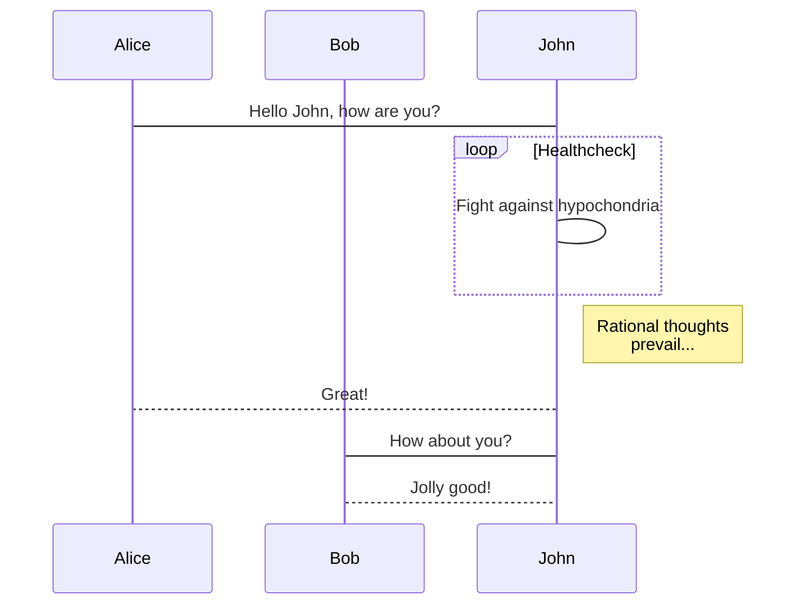

# Sentitomo


Table of Contents
=================

   * [Sentitomo](#sentitomo)
   * [Table of Contents](#table-of-contents)
      * [Idea](#idea)
      * [Problem Statement and Way to go](#problem-statement-and-way-to-go)
      * [Fundamental technologies](#fundamental-technologies)
         * [Node.js (Server)](#nodejs-server)
         * [Yarn (Server and Client)](#yarn-server-and-client)
         * [Express.js (Server)](#expressjs-server)
         * [GraphQL (Server API)](#graphql-server-api)
         * [React (Client - Front-End)](#react-client---front-end)
      * [The Application](#the-application)
         * [Overview](#overview)
         * [Installation](#installation)
            * [1. Install  Node.js and npm](#1-install--nodejs-and-npm)
            * [Intall Yarn (optional)](#intall-yarn-optional)
            * [Install dependencies](#install-dependencies)
            * [Install Java Version 6 and 8](#install-java-version-6-and-8)
            * [Install Python](#install-python)
            * [Install R](#install-r)
            * [Set up environment variables](#set-up-environment-variables)
            * [Start the server](#start-the-server)
         * [Database](#database)
         * [Server](#server)
            * [ML](#ml)
               * [Preface (Important Notice)](#preface-important-notice)
               * [R](#r)
               * [Python](#python)
               * [Java](#java)
            * [data](#data)
         * [Client](#client)
      * [Typical Workflow](#typical-workflow)
      * [Conclusion](#conclusion)


As part of our Master Team Project named "Topic Monitoring in the Pharmaceutical Industry" we wanted to develop an application to incorporate our findings and different Machine Learning scripts to show how a production environment can look like. The name of this application is "Sentitomo", a combination of the words "Sentiment Analysis" and "Topic Monitoring".

## Idea
The basic idea of accomplish such an task was to create a client-server architecture. The server part will be responsible for crawling social media data from Twitter and Facebook, as well as executing different machine learning tasks, such as sentiment analysis (classification ), topic detection and trend detection (clustering). Besides this, the results of those tasks are saved in an database to be available through an Application Programming Interface (API). This ensures that the results are persisted over time and can be analyzed.

## Problem Statement and Way to go
Throughout our work on this project we tried out variuous algorithms for machine learning (ML) and implemented them in different programming languages. After filtering all good performing algorithms we ended up with three programming languages:  R, Python and Java. The resulting problem now was to find a common platform for the server to work with those languages. The inital attempt to solve this issue was to choose on those language as the primary one and let it work with the others. But this had one drawback. If we would have chosen one of the ML languages as the primary one we would have not been able to replace this language anymore in favor of another where some models work better. This would lead to an abandoned machine learning language just serving as a wrapper language. So we were searching for an language where we will not write any machine learning code into but also capable of working with all the existing languages. This ensures that the different languages, and machine learning scripts can easily be switched out or updated without influencing other parts of the application because those will always interact with the wrapper language which copes with the different languages.
Because of the rising popularity and the possibility to be run on server and client side we chose JavaScript as our wrapper language. With the open-source and community driven framework called 'Node.js' it is possible to create powerful server and client applications, additionally it is possible to easly call child processes and communicate with them. This made JavaScript our way to go wrapper language.
 Based on this, we want to provide you an overview about the main technologies which we used to built up the application, how you the application is structured and how it eventually can be used in an production environment.


## Fundamental technologies

To give you an idea which technologies were used throughout the development process of Sentitomo this chapter gives an overview about the most prominent ones. We tried to only use frameworks which experience a high support from the developer community as well as developed by reliable sources. This section should not give an exhaustive explanation of all the used framework. Much more it should give a hint on why we choosed the different solutions for our application. 

### Node.js (Server)

Node.js is an open-source, cross-platform framework written in C, C++ and JavaScript, which makes it possible to run JavaScript code on the server-side. The initial release was on May the 27th, 2009 and was written by Ryan Dahl. Primarily it was built because the most common web server at this time, Apache HTTP Server, had troubles with a lot of concurrent connections and normally used blocking code executions which led to poor server performance.
 The idea behind Node utilizes a simplified event-driven programming paradigm where the program flow is determined by events (user clicks, messages from other methods etc.) to let so called callback functions take care of the result of method calls. With this structure the main thread of a Node.js application is not blocked by method executions. Basically a Node based application is only running on thread, but with non-blocking method calls it will never gets stucked at one point. This makes it easy to build highly scalable applications without the need of mulitple threads, which often leads to poor performance. But if it is needed Node can also spawn different threads and is not limited to only one.
Hand in hand to Node comes is a package manager called `npm` which stands for `Node Packaging Manager`. It is used to install, update and remove third party Node.js programs which are listed in the npm registry. npm enables developers to easily share and distribute Node.js code, so it can be used in other projects. All installed dependencies are listed inside a file called `package.json`. It contains all neccessary information about the different packages and their version numbers. Those packages are installed inside a folder called `node_modules`, which is accessed at runtime to load the different dependencies of a Node application.

### Yarn (Server and Client)

Yarn is an additional Node package manager built by Facebook based on npm, which improves it in some important parts. One biggest flaw of `npm` is that it stores the differen packges inside the `node_modules`in a non deterministic way. That means that the order of packages inside `node_modules` can differ from person to person depending on the order of installation. This can lead to bugs like 'Works on my machine' arise very quickly which makes debugging and hunting bugs down very frustrating. Also the the actual dependency tree can differ from the `node_modules` directory because duplicate dependencies are merged by Node itself. All these issues are resolved by Yarn by installing dependencies in a deterministic way and organizing duplicate ones in a better manner. In every projects it creates a file called 'yarn.lock'. With the use of it the installation process on different machines will be the exact same which makes bugs like 'Works on my machine' very unlikely. Based on thi advantages we used Yarn as our desired package manager.

### Express.js (Server)

Express.js is a JavaScript framework built with Node.js and today the de-facto standard to build a web-server application with Node. It is an MIT licensed, open-source published directly from the developers of Node.js.
 In its fundamental form it is very lightweight and only offers the minimum functionalities to build a web-server. But it offers great opportunities to all kind of plugins, like logging, templating engines, server side rendering, and even more. This makes it very versatile and the number one solution for developing a web server with Node.js. Therefore we chossed it as the framework to build our server architecture.

### GraphQL (Server API)

Because we wanted to integrate an API interface for easy data sharing between server and client we searched for a state of the art solution and came up with GraphQL. It is the definition for the combination of two things. On the one hand it is a query language for any existing API/connection to a database and on the other hand it is an server-side runtime for executing queries that are defined by a type system based on data from any backend storage. It is actively maintained by the the open-source community, created by Facebook and said to be next big thing after REST.
The major key part of  GraphQL is that it  can be set up on any database management system (DBSM), like SQL based or document based ones. It is not bound to any specific programming language nor to any server implementation. It is completely decoupled from those, which makes it easy to integrate in any existing system. Another advantage is, that it does not dictate your backend storage option. This makes it possible to easily switch the backend without affecting the existing API. But one of the most impressing parts is, that it solves a big issue we had with REST. When querying an instance in REST, this very often ended up with multiple queries to different endpoints, while with GraphQL this can be accomplished with only one request. 
For example in our use case. A query for an tweet and the corresponding author of the tweet in REST would normally result in two calls. One to the tweet endpoint and one the author endpoint. With an GraphQL based API it is only one call, what we are going to see in the next section.

A GraphQL service is defined by its `type definitions`. A sample one would look like the follwoing: 
```
type Query {
  tweet: Tweet
}

type Tweet {
  id: ID
  message: String
  author: Author
}

type Author {
  id: ID
  name: String
}
```
Type definitions are like a schema for the API. They define which type requests are accepted by API. 

So called `resolvers` then take care of the actual database call to get the instances needed. 
```
function Query_tweet(request) {
  return database.getTweet();
}

function Tweet_message(tweet) {
  return tweet.getMessage();
}

function Tweet_author(tweet) {
  return tweet.getAuthor();
}
```
An example request to the API could be:

```
{
    tweet{
        id
        message
        author{
            id
            name
        }
    }
}    
```
Respone:
```
{
    data: {
        tweet: {
            id: 123456789
            message: "This is a test"
            author: {
                id: 1
                name: "John Doe"
            }
        }
    }
}
```
With this example it is very clear to see that it is possible to easily request only the data we want and do this with only one API request. This and the fact that GraphQL can work with any programming language, any server implementation and the option to completely switch out the DBMS if needed, we chose it as our standard API runtime.
 
### React (Client - Front-End)

To develop our front-end client side we wanted to use a modern, well supported and written framework and found the best solution in `React`. React is an open source front-end JavaScript library for dynamically creating user interfaces. It is very actively maintained by Facebook and the Open Source community and offers a variety of additional packages which can be used to extend the functionalities of it. Currently it is available in Version 15 with Version 16 at beta state. A lot of big companies are building their  web application based on React. One of the most prominent ones are AirBnB, Netflix and Facebook itself. 
React uses a sepcial JavaScript syntax called `.jsx`. With that it is possible to write HTML code inside a JavaScript file. A simple hello world `.jsx` example file looks like this:
```
import * as React from 'react';

class App extends React.Component {
   render() {
      return (
         <div>
               <p>Header</p>
               <p>Content</p>
               <p>Footer</p>
         </div>
      );
   }
}

export default App;

```
As we see inside the `render` method of this class we can write pure HTML code without breaking the code. React in the end renders this HTML dynamically to the Virtual Document Object Model (Virtual DOM). Another notable feature of React. Instead of rendering directly to the HTML DOM it caches all changes inside the virtual DOM and updates the browsers displayed DOM in a efficient way accordingly.
 React always tries to work with a component oriented way of structuring a front-end. For example a sidebar navigation is one component. Inside this component multiple link components are nested. This makes React projects very structured and good to maintain if some features need to be added. 
React is in our eyes one of the most versatile tool for developing dynamic front-ends which makes it the best fit for creating the client part of Sentitomo.

## The Application

Due to the fact that Sentitomo is built up with different technologies, there are some requirements that need to be fulfilled when you are trying to set up the application. To clarify the different environment settings and the overall structure the next section tries to clarify all of those facts.

### Overview

The directory structure of the application can be seen in the following: (*without files except package.json and yarn.lock*):

    .
    ├── client
    │   ├── package.json
    │   ├── build
    │   ├── public
    │   ├── src
    │   │   ├── components
    │   │   ├── data
    │   │   ├── fonts
    │   │   ├── layouts
    │   │   ├── styles
    │   │   └── tests
    │   └── yarn.lock
    └── server
        ├── ML
        │   ├── Java
        │   ├── Python
        │   ├── R  
        ├── data
        ├── middlewares
        ├── package.json
        ├── service
        └── yarn.lock
        
Sentitomo is divided into two parts, client and server. The main entry point of the application (`/server/server.js`) lies in the server directory which is starting up the node  server process and serving files form the build directory of the client. Before we have a deeper look into the different directories we first introduce you the installation process of Sentitomo.


### Installation

The main steps to install Sentitomo are:

 1. Install Node.js and npm
 2. Install Yarn (optional)
 3. Install dependencies
 4. Install Java Version 6 an 8 
 5. Install Python Version 3 
 6. Install R
 7. Set up environment variables
 8. Start the server

#### 1. Install  Node.js and npm

Node.js always comes in combination with it's packaging manager npm . It can be installed on any common OS, and therefore you can use nearly any server operating system you like. Sentitomo was built on MacOS X Sierra Version 10.12.6 so we suggest using a Unix based server here. To install Node you can either use the downloads provided by the [Node website](https://nodejs.org/en/download/) or using one of the following aproaches.

__MacOS:__

Using [homebrew](https://brew.sh/):

    $ brew install node

__Linux:__

On Linux there are plenty of different installation possibilities but here we suggest to use the ones provided on the [Node website](https://nodejs.org/en/download/package-manager/).

#### Intall Yarn (optional)

After installing Node it comes to the decision to either stay with npm as your desired dependency manager or additionally install Yarn. If you decide to go with yarn this has the advantage that you will get exact the same dependency version as we had while testing Sentitomo. This is ensured with the `yarn.lock` files. This is a non- mandatory step but when you are using npm it can be the case that you will get a slightly different dependency tree than with npm.

 Yarn is installed via npm with the following command.

    sudo npm install -g yarn # use sudo to ensure yarn is on your path

#### Install dependencies
Now either npm or Yarn is set up we can use it to install the dependencies. The following commands assume that you are in the top level `sentitomo/` of the application.

**npm:**
    $ # install server dependencies
    $ cd server
    $ npm install
    
    $ # install client dependencies
    $ cd ../client
    $ npm install

**Yarn:**
    
    $ # install server dependencies
    $ cd server
    $ yarn install
    
    $ # install client dependencies
    $ cd ../client
    $ yarn install

#### Install Java Version 6 and 8

Some of the R scripts we use for machine learning need both versions of Java to work. To install the versions just follow the basic instructions of your specified distribution. You just have to ensure that the server has access to both libraries.

#### Install Python
The Python scripts for topic detection are based on Pyhton version 3. Follow the common ways to install it on your server OS and ensure that the `python3` command is in the path of the server user. 

**Dependencies**
Before you can run the Python files you have to install these modules through pip3:

    $ pip3 install sklearn
    ....

#### Install R

**MacOS:**
On MacOS we suggest using the `.pkg`file from the [r-project site](https://cran.r-project.org/bin/macosx/) to install R.

**Linux:**
The same way applies for Linux, please have a look at the [r-project site](https://cran.r-project.org/bin/macosx/) to install R.

#### Set up environment variables

Sentitomo is using some environment variables to connect to different services which are necessary to let the applicaiton do its job. 

**Database**

Our application is using a MySQL database as it's backend. To use your database you have to modify the `.env` file in the root of `sentitomo/server`. This file is used for setting up some configuration settings. Just fill out the following key/value pairs to connect your database.

    DB_NAME=yourDBName
    DB_USER=yourDBUser
    DB_PASS=userPassword
    DB_HOST=hostURL
*When the application is connected to the first time it will create the mandatory table structure in your database automatically.* 

**Twitter**

In order have access to the Twitter Streaming API you have to obtain your client credentials by creating a new Twitter APP on the [Twitter Dev Website](https://apps.twitter.com/app/new). After doing so, also save your credentials in the `.env`file:

    TWITTER_CONSUMER_KEY=yourConsumerKey
    TWITTER_CONSUMER_SECRET=yourConsumerSecret
    TWITTER_ACCESS_TOKEN_KEY=yourAccessTokenKey
    TWITTER_ACCESS_TOKEN_SECRET=yourAccessTokenSecret

It is also possible to change the filters which are used to crawl the Twitter API here.
 A `,` indicates an OR and a whitespace an AND concatenation.

    TWITTER_STREAMING_FILTERS="YOURFILTERS"

Examples: 

 - `"humira,abbvie"` crawls all tweets that contain `humira OR abbvie` 
 -  `"humira abbvie"` crawls all tweets that contain `humira AND abbvie`
   

#### Start the server
After installing all necessary software fragments you just need to start the server with the following command, assuming you are in the `sentitomo/server`directory:

    $ npm start
    #or 
    $ yarn start

After starting the server is listening on Port:8080.
If you test locally then visit:

 - Front-End: [localhost:8080/app/dashboard](localhost:8080/app/dashboard) 
 - GraphQL Endpoint:  [localhost:8080/graphql](localhost:8080/graphql) 
 - Endpoint for testing the API: [localhost:8080/graphiql](localhost:8080/graphiql)

If you want to access the server from a remote destination just switch out localhost with your server IP or domain.


In the next part we will have a deeper look into the database and the directories of Sentitomo.

### Database

By default Sentitomo is using a MySQL database, but theoretically it can be used with any other DBMS. We chose a MySQL database because for us it was the easiest and fastest way DMBS to set up. When the appilication is initially connected to the database it is creating all necessary tables and foreign keys automatically. In the following the different CREATE statements of the tables are listed.

__TW_CORE__ holds all raw information of the tweets.

    CREATE TABLE `TW_CORE` (
      `id` varchar(255) NOT NULL,
      `keywordType` varchar(255) DEFAULT NULL,
      `keyword` varchar(255) DEFAULT NULL,
      `created` datetime DEFAULT NULL,
      `createdWeek` int(11) DEFAULT NULL,
      `toUser` varchar(255) DEFAULT NULL,
      `language` varchar(255) DEFAULT NULL,
      `source` varchar(255) DEFAULT NULL,
      `message` varchar(255) DEFAULT NULL,
      `latitude` varchar(255) DEFAULT NULL,
      `longitude` varchar(255) DEFAULT NULL,
      `retweetCount` int(11) DEFAULT NULL,
      `favorited` tinyint(1) DEFAULT NULL,
      `favoriteCount` int(11) DEFAULT NULL,
      `isRetweet` tinyint(1) DEFAULT NULL,
      `retweeted` int(11) DEFAULT NULL,
      `createdAt` datetime NOT NULL,
      `updatedAt` datetime NOT NULL,
      `TWUserId` varchar(255) DEFAULT NULL,
      PRIMARY KEY (`id`),
      KEY `TWUserId` (`TWUserId`),
      CONSTRAINT `TW_CORE_ibfk_1` FOREIGN KEY (`TWUserId`) REFERENCES `TW_User` (`id`) ON DELETE SET NULL ON UPDATE CASCADE
    ) ENGINE=InnoDB DEFAULT CHARSET=utf8;

__TW_Users__ contains information about the tweet authors.

    CREATE TABLE `TW_User` (
      `id` varchar(255) NOT NULL,
      `username` varchar(255) DEFAULT NULL,
      `screenname` varchar(255) DEFAULT NULL,
      `createdAt` datetime NOT NULL,
      `updatedAt` datetime NOT NULL,
      `followercount` bigint(20) DEFAULT NULL,
      PRIMARY KEY (`id`)
    ) ENGINE=InnoDB DEFAULT CHARSET=utf8;


__TW_SENTIMENT__ contains information about the sentiments of different tweets.

    CREATE TABLE `TW_SENTIMENT` (
      `id` varchar(255) NOT NULL,
      `sarcastic` double DEFAULT NULL COMMENT 'Sarcasm probability',
      `emo_senti` double DEFAULT NULL COMMENT 'Sentiment of emojis in the message',
      `emo_desc` varchar(255) DEFAULT NULL COMMENT 'Emojis in the message',
      `r_ensemble` varchar(255) DEFAULT NULL COMMENT 'Result from R sentiment analysis',
      `python_ensemble` varchar(255) DEFAULT NULL COMMENT 'Result from Python sentiment analysis',
      `sentiment` varchar(255) DEFAULT NULL COMMENT 'Final sentiment result',
      `createdAt` datetime NOT NULL,
      `updatedAt` datetime NOT NULL,
      PRIMARY KEY (`id`),
      CONSTRAINT `TW_SENTIMENT_ibfk_1` FOREIGN KEY (`id`) REFERENCES `TW_CORE` (`id`) ON DELETE CASCADE ON UPDATE CASCADE
    ) ENGINE=InnoDB DEFAULT CHARSET=utf8;

__TW_TOPIC__ contains information about the topics of different tweets.

    CREATE TABLE `TW_TOPIC` (
      `id` varchar(255) NOT NULL,
      `topic1Month` varchar(255) DEFAULT NULL,
      `topic1Month_C` varchar(255) DEFAULT NULL,
      `topic3Month` varchar(255) DEFAULT NULL,
      `topic3Month_C` varchar(255) DEFAULT NULL,
      `topicWhole` varchar(255) DEFAULT NULL,
      `topicWhole_C` varchar(255) DEFAULT NULL,
      `createdAt` datetime NOT NULL,
      `updatedAt` datetime NOT NULL,
      PRIMARY KEY (`id`),
      CONSTRAINT `TW_TOPIC_ibfk_1` FOREIGN KEY (`id`) REFERENCES `TW_CORE` (`id`) ON DELETE CASCADE ON UPDATE CASCADE
    ) ENGINE=InnoDB DEFAULT CHARSET=utf8;


### Server

All the backend server logic is placed inside the `server`directory. We won't cover every single file or directory here, but we want to introduce the most important ones which are the `ML` and `data` directories and the `server/service/TwitterCrawler.js` file.

#### ML
Inside the `ML` directory we placed all files which are related to the machine learning tasks, like sentiment analysis, topic detection and trend detection. It is divided in three subdirectories `Java`, `Python` and `R` to seperate the different programming languages. In the top level of `ML` you can find the wrapper files for incorporating the different programming languages with Javascript, `ml_wrapper.js` and `preprocess.js`. To let the different programming files work together we use Node's opportunity to spawn child processes and capture the output of these. To do so, we wrote a small file for calling the foreign code in a more convenient way, than directly spawning the child processes in the `ml_wrapper.js`. Those methods can be found in `/server/util/foreignCode.js`.
With that procedure we can spawn the machine learning tasks asynchronously to the main process, which leads to the fact that the main thread is not blocked or influenced by executing foreign code. In the following we want to explain how we integration works in detail.

##### Preface (Important Notice)

It is not possible to pass complex data types and structures from Javascript to R, Python or Java. It can either be a **plain string** or a **JSON encoded string** which then needs to be parsed by the executed file. The same applies for the output. If the foreign code wants to output an complex object it is the best practice to convert it to a JSON representation so that the Node.js proceess can easily work with it. 

__Possible packages and modules to use with JSON__
* __R__ with [RJSONIO](https://cran.r-project.org/web/packages/RJSONIO/index.html)
* __Pyhton__ with [JSON Module](https://docs.python.org/2/library/json.html)
* __Java__ with [org.json library](https://github.com/stleary/JSON-java)

__Paths__
When the foreign code needs access to some other files inside a directory it is mandatory to know that all files are executed in the scope of `./server/`. For example if a Python file needs to load a model from the Python directory it has to do it with the relative path `./ML/Python/filename.bin`.

__Examples__
All examples in JavaScript are written with ES6. To have a look the wrapper function for calling the foreign code, have a look at `/server/wrapper/codeWrapper.js`.

##### R
For integrating R with the server we were at first using a package called [r-script](https://github.com/joshkatz/r-script) package. It ships with a handy R function called `needs()`. This is basically a combination of `install()` and `require()`.  This ensured that the different packages which are required by our scripts are installed and loaded in the correct way. Therefore every R file has to use `needs()` instead of `ìnstall.package("packageName")` and `require("package")/load("package")`. Also it is recommended to place all functions at the top of the R files.
At the end of our project we faced some problems with the package so we decided to write our own implementation of calling R files, as mentioned in the introduction of `ML`. We followed the same approach as the `r-script` package did, included the `needs.R` file but simplified the process a little bit, so it could work with our application,
To send data to the R process from and back to the Javascript we can call the R file from Javascript like the follwoing: 

*JavaScript*
```
import { RShell } from './util/foreignCode'

RShell("example/test.R")
  .data([tweet.message])
  .call(function(err, d) {
    if (err) throw err;
    console.log(d);
  });
```

One thing to mention is that the implementation of `RShell` reads the console output from the R files. So if a file wants to a pass a value back to the JavaScript, for example the output of a classification task it **SHOULD NOT ASSIGN IT TO VARIABLE** just print it the console. The best way to do it is to write:

```
cat(yourVariable)
```
With `cat` it is possible to remove the `[X]` identifier in front of the output. If you want to print out a named variable the best approach is to use 

```
cat(unname(yourVariable))
```

*R*
```
source(needs.R)
needs(dplyr) # require every library so
args = commandArgs(trailingOnly=TRUE) # read command line

# Here comes all your function
# function 1
# function 2
# *****

# assign the retrieved value to a local one, this comes from the Javascript code
# It was passed like this {message: tweet.message}. It has the same name, 'message'.
out <- args[1] # first command line argument
out <- gsub("ut","ot",out) # do something with it
out # last line of the script should always print the value which you want to return to the server
```


**Example for converting JSON to data.frame in R**

See this [great answer onStackoverflow](https://stackoverflow.com/a/16948174)

*JavaScript*


```
import { RShell } from './util/foreignCode'


const message = {message: "[{"name":"Doe, John","group":"Red","age (y)":24,"height (cm)":182,"wieght (kg)":74.8,"score":null},
    {"name":"Doe, Jane","group":"Green","age (y)":30,"height (cm)":170,"wieght (kg)":70.1,"score":500},
    {"name":"Smith, Joan","group":"Yellow","age (y)":41,"height (cm)":169,"wieght (kg)":60,"score":null},
    {"name":"Brown, Sam","group":"Green","age (y)":22,"height (cm)":183,"wieght (kg)":75,"score":865},
    {"name":"Jones, Larry","group":"Green","age (y)":31,"height (cm)":178,"wieght (kg)":83.9,"score":221},
    {"name":"Murray, Seth","group":"Red","age (y)":35,"height (cm)":172,"wieght (kg)":76.2,"score":413},
    {"name":"Doe, Jane","group":"Yellow","age (y)":22,"height (cm)":164,"wieght (kg)":68,"score":902}]'"}

RShell("example/test.R")
  .data([message])
  .call(function(err, d) {
    if (err) throw err;
    console.log(d);
  });
```

*R*
```
needs(RJSONIO)   
args = commandArgs(trailingOnly=TRUE) # read command line
json <- fromJSON(args[1])   # comes from Javascript {message: variable}
json <- lapply(json, function(x) {
  x[sapply(x, is.null)] <- NA
  unlist(x)
})
do.call("rbind", json)
```

Outcome is a data.frame
```
     name           group    age (y) height (cm) wieght (kg) score
[1,] "Doe, John"    "Red"    "24"    "182"       "74.8"      NA   
[2,] "Doe, Jane"    "Green"  "30"    "170"       "70.1"      "500"
[3,] "Smith, Joan"  "Yellow" "41"    "169"       "60"        NA   
[4,] "Brown, Sam"   "Green"  "22"    "183"       "75"        "865"
[5,] "Jones, Larry" "Green"  "31"    "178"       "83.9"      "221"
[6,] "Murray, Seth" "Red"    "35"    "172"       "76.2"      "413"
[7,] "Doe, Jane"    "Yellow" "22"    "164"       "68"        "902"
```


##### Python
For Python we initially used a package called [python-shell](https://github.com/extrabacon/python-shell) to execute single Python files. But as our Python version switched from 2 to 3 we had some issues to make this package work with the newer version. So in the end we decided to add the the spawning of the child process for Pyhton to  `/server/util/foreignCode.js`. With our implementation we were able to set the Python version manually. Additionally the files are able to retrieve command line arguments which makes the communication between JS and Python possible. This is again based on reading the console prints of the Python file. One advice is, to make sure to not heavily use the console for prints, because the main process only needs to know the final result of the script.

A small example with passing JSON forth and back: 

*Javascript*
```
import { PythonShell } from './util/foreignCode';

/**
 * @function test
 * @param  {String} message  Message to the file
 * @param  {Function} callback Function to handle the sentiment result
 * @description Test function to show the Python procedure
 * @return {String} Result of the 
 */
var test = function(message, callback) {
    PythonShell('./ML/Python/test.p').data([message]).call(result => {
        callback(result.trim());
    })
}

test('{"message": "This is my message"}', result => {
	console.log(result);
});


```

*Python*
```
import sys, json

# simple JSON echo script
for line in sys.argv[1:]:
  print json.dumps(json.loads(line))


#Plain decode JSON
json.loads(argv[1])

```
**Output in the Javascript**
```
{"message": "This is my message"}
```

##### Java
For Java we followed the same approach and added the spawning process of the files to our existing file for spawning foreign code. It is the exact same process like with Python, the only thing which is different that you have to execute the .jar instead of the Python file.

*Javascript*

    import {JavaShell} from './wrapper/codeWrapper';';

     /**
         * @function test
         * @param  {String} message  Message to the file
         * @param  {Function} callback Function to handle the sentiment result
         * @description Test function to show the Java procedure
         * @return {String} Result of the 
         */
        var test = function(filename, callback) {
            JavaShell("./ML/Java/test.ja").data([message]).call(result => {
                callback(result.trimt());
            })
        }
        
    test("Hello world", result => {
    	console.log(result)
    });

*Java*

    public class HelloWorld {
   
        public static void main(String[] args) {
            // Prints the command line argument to the terminal window.
            System.out.println(args[0]);
        }
    
    }


#### data

Inside the `data` directory the connection to the database and the `GraphQL` schema defininiton are expressed. 
For connecting to the database we use a package called [Sequlize.js](http://docs.sequelizejs.com/). It provides a higher level way to work with databases. It provides methods  which just define the database schema and the resulting SQL queries for inserting, updating and deleting records are build dynamically and fully handled by the package itself. Sequliue  supports PostgreSQL, MySQL, SQLite and MSSQL dialects. It was also used in the resolver function for the GraphQL API (`resolvers.js`).

Another main part of the `data` directory is the set up of GraphQL which is written in `resolvers.js`. It handles all the request to the API whose schema is defined in `schema.js`. For this part we used a Node.js package called [apollo-server](https://github.com/apollographql/apollo-server). It is a great, easy to use open-source implementation of GraphQL on the server-side.
 In the following we want to provide a sample request to the API and what the response looks like:

Request sent to [localhost:8080/graphql]():
```
{
  tweet(id: "881026061806571520"){
    id
    message
    sentiment {
      id
      sentiment
    }
    author{
      id
      screenname
      username
    }
  }
}
```

Response:
```
{
  "data": {
    "tweet": {
      "id": "881026061806571520",
      "message": "New2Trip: Rheumatoid arthritis-specific cardiovascular risk scores are not superior to general risk scores: va<U+2026> https://t.co/KRZDi95ctL",
      "sentiment": {
        "id": "881026061806571520",
        "sentiment": "negative"
      },
      "author": {
        "id": "2199494760",
        "screenname": "TripPrimaryCare",
        "username": "Trip Primary Care"
      }
    }
  }
}
```

__What is happening ?__
At first the request from the client is piped through the resolvers of `resolvers.js` and the `tweet(_,args)` method is invoked because the request accessed the `tweet` endpoint. The `args` object contains all arguments provided to the endpoint. In this example only the `id` value of the tweet. To get the result from the database we used the database model object of sequlize.js called `Tweet` which is defined in the `connectors.js` file. It returns the exact tweet 'where tweet.id = args.id'. Because only a fraction of the tweet fields were requested.
In the end a new data object is constructed which contains all the information that were requested.

`resolvers.js` (truncated)
```
import {
    Author,
    Tweet,
    Sentiment,
    Topic
} from './connectors';


const resolvers = {
    Date: GraphQLMoment,
    Query: {
        ...,
        tweet(_, args) {
            return Tweet.find({
                where: args
            });
        },
        ...
    },
    Author: {
        tweets(author) {
            return author.getTweets();
        },
    },
    Tweet: {
        author(tweet) {
            return tweet.getTW_User();
        },
        sentiment(tweet) {
            return tweet.getTW_SENTIMENT();
        },
        topic(tweet) {
            return tweet.getTW_TOPIC();
        }
    },
};
```
`schema.js` (Provides the different API queries and the available fields)
```
/**
 * @constant typeDefinitions
 * @type {String}
 * @description Type definition schema for the GraphQL API. here all types, queries and mutations are specified which the API is offering
 */
const typeDefinitions = `

  scalar Date
  type Tweet {
    id: String
    keywordType: String
    keyword: String
    created: String
    createdWeek: Int
    toUser: String
    language: String
    source: String
    message: String
    messagePrep: String
    latitude: String
    longitude: String
    retweetCount: Int
    favorited: Boolean
    favoriteCount: Int
    isRetweet: Boolean
    retweeted: Int
    author: Author
    sentiment: Sentiment
    topic: Topic
  }

  type Author {
    id: String
    username: String
    screenname: String
    tweets: [Tweet]
  }

  type Sentiment {
    id: String
    sentiment: String
  }

  type Topic {
    id: String
    topic1Month: String
    topic1Month_C: String
    topic3Month: String
    topic3Month_C: String
    topicWhole: String
    topicWhole: String
  }

  type Query {
    tweet(id: String): Tweet
    sentiment(id: String): Sentiment
    topic(id: String): Topic
    author(username: String): Author
    tweets(limit: Int, offset: Int, startDate: Date, endDate: Date): [Tweet]
    count(startDate: Date, endDate: Date): Int
  }

  schema {
      query: Query
  }
';
export default [typeDefinitions];
```


### Client

Sentitomo comes pre-shipped with an own front-end implementation written in React. Because of the GraphQL API it is even possible to totally switch out the entire client directory and develop another solution.
When the application is started, the front-end is available at [localhost:8080/app/](localhost:8080/app/). It offers two different views right now:
	* [/dashboard](localhost:8080/app/dashbaord) rudimentary dashboard
	* [/toolbox](localhost:8080/app/toolbox) different options to initate machine learning tasks dynamically 

## Typical Workflow

When the server is started the typical sequence of crawling Twitter tweets is the following:


## Conclusion

With this application we wanted to show one way of using our findings and algorithms in an production like environment. We showed how it is possible to built a server application which is capable of integrating different programming languages and use them for machine learning in an efficient way. With Node.js it is an ease to set up an highly scalable server which can handle asynchronous execetuions of foreign code very well. With the help spawning child processes Node.js is able to communicate with those and retrieve results from them. With the help of GraphQL we set up a very modern and reliable API which any front end can use to retrieve the result the machine learning algorithms produced from the database. If it is necessary to switch out the DBMS in the future the API endpoints will not change and the front-end system would not need to be heavily restructered. 
The client side was implemented in React, which makes it highly dynamical from a user point of view and well structured from a programmer's point of view. With the help of different packages it was possible to built a easy to use and good looking user interface.
All in all we hope that we could show you one possible way of how to build a good solution for monitoring topics and trends in social media today.



